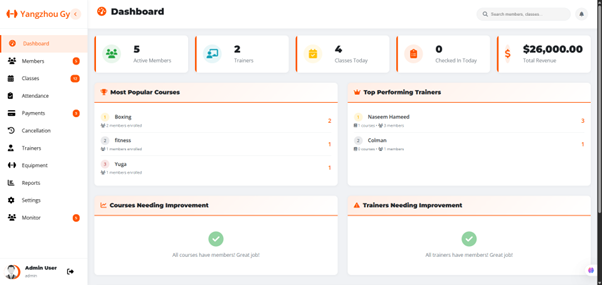
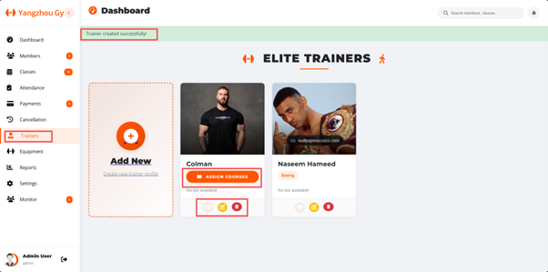
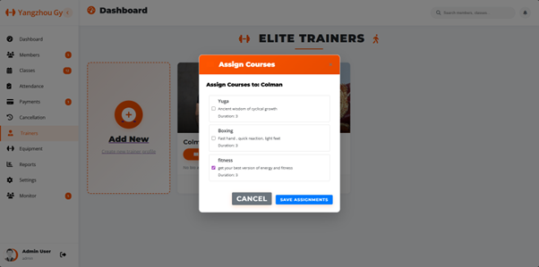
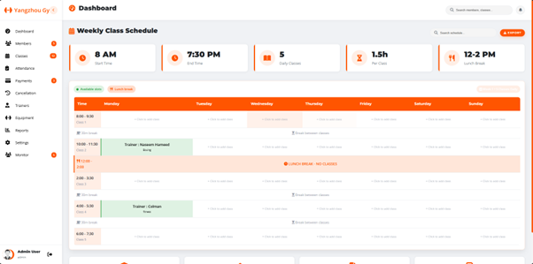
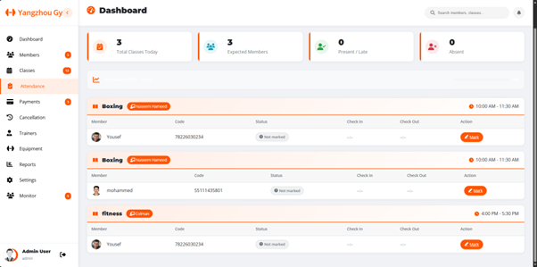
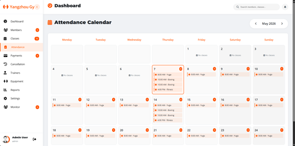
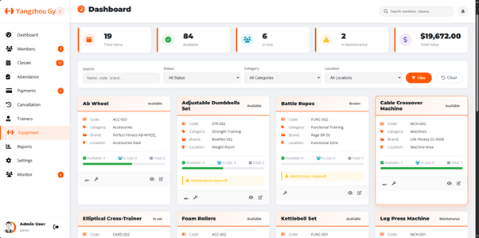
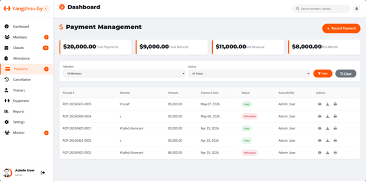
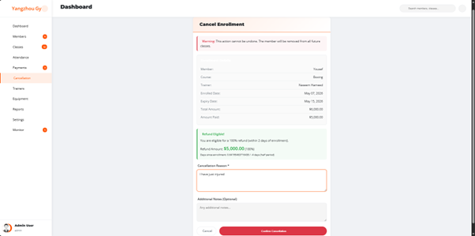
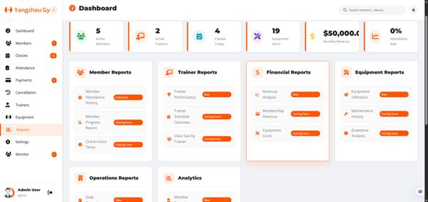

# 🏋️ Gym Management System

A full-stack web application designed to manage and organize daily gym operations through a centralized management system.

The system provides functionality for managing members, trainers, courses, class schedules, attendance, equipment, payments, cancellations, and reports through an administrative dashboard.

---

## 🚀 Features

### 👥 Member Management
- Manage gym member information
- Organize member records
- Track member-related activities

### 🏋️ Trainer Management
- Manage trainer information
- Organize trainer records
- Associate trainers with gym activities and courses

### 📚 Course Management
- Manage gym courses
- Organize available training programs
- Manage class instances

### 📅 Schedule Management
- Create and manage gym schedules
- Organize classes and training sessions
- Coordinate courses and trainers

### ✅ Attendance Management
- Record member attendance
- Manage attendance records
- Track participation in gym activities

### 💳 Payment Management
- Manage member payments
- Maintain payment records
- Support gym financial administration

### 🏃 Equipment Management
- Manage gym equipment records
- Organize equipment information

### ❌ Cancellation Management
- Manage cancellation records
- Handle cancelled activities or registrations

### 📊 Reports
- Generate and manage gym-related reports
- Provide administrative information for gym operations

### 🔐 Authentication & Administration
- User authentication
- Administrative dashboard
- Centralized management interface

---

## 🛠️ Technologies Used

**Backend**
- PHP
- Laravel 12

**Frontend**
- Blade
- HTML
- CSS
- Bootstrap
- JavaScript
- jQuery
- AdminLTE

**Database**
- MySQL

**Development Tools**
- Composer
- Vite
- Git
- GitHub

---

## 📂 Project Structure

```text
Gym-Management-System/
│
├── app/                 # Application logic
├── bootstrap/           # Laravel bootstrap files
├── config/              # Application configuration
├── database/            # Migrations and database files
├── public/              # Public assets
├── resources/
│   └── views/
│       ├── admin/
│       ├── attendance/
│       ├── auth/
│       ├── cancellation/
│       ├── class_instance/
│       ├── course/
│       ├── dashboard/
│       ├── equipment/
│       ├── member/
│       ├── payments/
│       ├── reports/
│       ├── schedule/
│       └── trainer/
├── routes/              # Application routes
├── storage/             # Application storage
├── tests/               # Automated tests
├── composer.json
├── package.json
└── README.md

```

---

## ⚙️ Installation

### 1. Clone the repository

```bash
git clone https://github.com/AimanALqurashi1/Gym-Management-System.git
cd Gym-Management-System
```

### 2. Install PHP dependencies

```bash
composer install
```

### 3. Install frontend dependencies

```bash
npm install
```

### 4. Create the environment file

```bash
cp .env.example .env
```

On Windows PowerShell:

```powershell
Copy-Item .env.example .env
```

### 5. Generate the application key

```bash
php artisan key:generate
```

### 6. Configure the database

Update the database configuration in your `.env` file:

```env
DB_CONNECTION=mysql
DB_HOST=127.0.0.1
DB_PORT=3306
DB_DATABASE=gym_management
DB_USERNAME=root
DB_PASSWORD=
```

### 7. Run database migrations

```bash
php artisan migrate
```

### 8. Start the application

```bash
php artisan serve
```

Then open:

```text
http://127.0.0.1:8000
```

---

## 📸 Screenshots

### Admin Dashboard


### Trainer Management


### Course Assignment


### Weekly Class Schedule


### Attendance Management


### Attendance Calendar


### Equipment Management


### Payment Management


### Cancellation & Refund Management


### Reports & Analytics

---

## 💡 Project Highlights

This project demonstrates practical experience with:

- Full-stack web development
- Laravel MVC architecture
- PHP backend development
- Relational database management
- CRUD operations
- Authentication and authorization
- Administrative dashboards
- Data management
- Responsive web interfaces
- Modular application development

---

## 👨‍💻 Author

**Aiman Mohammed**

Software Engineer interested in Full-Stack Development, Backend Development, Artificial Intelligence, and Machine Learning.